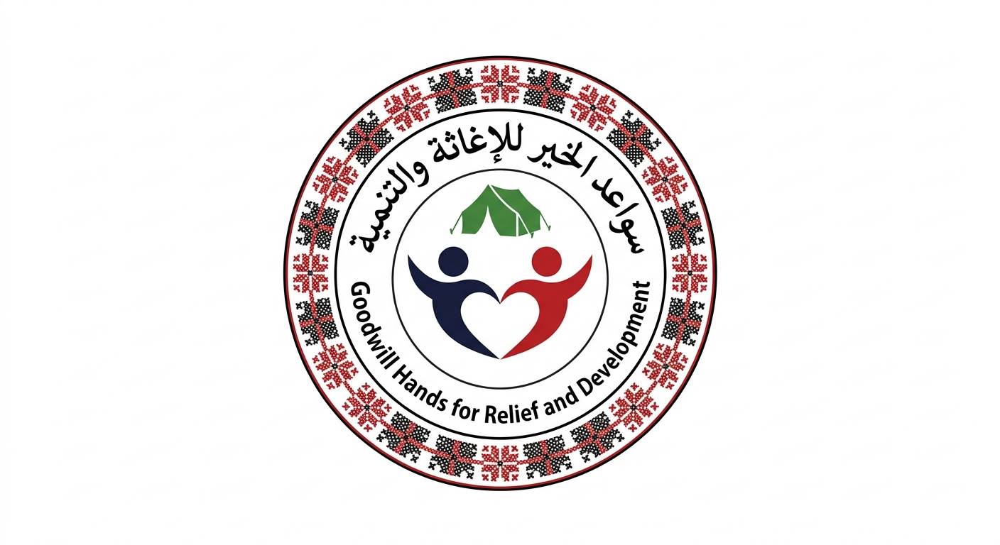

# 🌿 منظومة سواعد الخير — نظام الإدارة اللوجستية

### بوابة رقمية متكاملة لإدارة التكيات الميدانية والمساعدات الإغاثية

---

## 📖 ما هو هذا النظام؟

**سواعد الخير ERP** هو نظام إدارة رقمي متكامل صُمّم خصيصاً لـ **سواعد الخير للإغاثة والتنمية**، يُمكّن المنظمة من إدارة عمليات توزيع الطعام، والمخازن، والموظفين، والتكيات الميدانية — كل ذلك من مكان واحد، بواجهة عربية سهلة لا تحتاج لأي خبرة تقنية.

> *"من لحظة دخول المواد للمستودع، حتى وصول الوجبة لأصحابها — كل خطوة موثّقة وشفافة."*

---

## ✨ أبرز ما يقدمه النظام

### 📦 إدارة المخزون المركزي
- تسجيل جميع المواد الغذائية وغير الغذائية في المستودع المركزي
- متابعة الكميات المتاحة لحظة بلحظة
- تنبيه تلقائي عند اقتراب أي صنف من حد الأمان
- إضافة أو خصم كميات بضغطة واحدة مع إدخال الرقم مباشرة
- سجل تدقيق كامل لكل حركة دخول وخروج

### 🍽️ إدارة التكيات والمطابخ الميدانية
- تسجيل التكيات مع موقعها ومسؤولها والهدف اليومي للوجبات
- كل تكية تملك مخزونها الخاص المستقل
- متابعة عدد الوجبات المطهوة يومياً
- رابط مشاركة خاص لكل تكية يفتح واجهة مستقلة

### 🔄 نظام طلبات التموين — 3 مراحل
نظام متكامل يضمن الشفافية الكاملة في توزيع المواد:

| المرحلة | المسؤول | الإجراء |
|---------|---------|---------|
| 1️⃣ تقديم الطلب | مسؤول التكية | يطلب المواد المطلوبة من المخزون الرئيسي |
| 2️⃣ موافقة المدير | مدير النظام | يراجع الطلب ويوافق أو يرفض |
| 3️⃣ التسليم | أمين المستودع | يجهّز المواد ويؤكد التسليم |

عند التأكيد: تُخصم المواد من المستودع المركزي وتُضاف تلقائياً لمخزون التكية المعنية.

### 📊 تسجيل توزيع الوجبات
- تسجيل عدد الوجبات الموزّعة يومياً لكل منطقة
- رسم بياني أسبوعي حي يعكس التوزيع الفعلي
- إحصائيات: وجبات اليوم، الأسبوع، الإجمالي التراكمي

### 📋 الطلبات الداخلية
- نموذج رقمي يمكن مشاركة رابطه مع أي موظف في المنظمة
- يستقبل طلبات الصيانة، المستلزمات، النقل، الإجازات وغيرها
- المدير يوافق أو يرفض مع ذكر السبب
- متابعة حالة كل طلب بشكل فوري

### 👥 إدارة الموظفين والكادر
- تسجيل بيانات الموظفين مع أدوارهم وجهات الاتصال
- 6 أدوار مختلفة: مدير النظام، مسؤول مخزن، مسؤول تكية، موظف توزيع، سائق، طباخ
- إضافة ملاحظات لكل موظف
- صور رمزية تلقائية لسهولة التعرف

### 🗓️ سجل الحضور والغياب
- شبكة شهرية بصرية — كل موظف صف، كل يوم عمود
- **ضغطة واحدة** تغير الحالة: حاضر ✓ → غائب ✗ → إجازة ○
- عداد تلقائي لكل موظف (أيام الحضور / الغياب / الإجازة)
- تنقل سهل بين الشهور
- بحث فوري بالاسم

### 💰 المصروفات الجانبية
- تسجيل المشتريات والنفقات الطارئة
- تصنيف تلقائي: صيانة، وقود، شراء معدات، إغاثة طارئة، وغيرها
- سجل تاريخي كامل مع إمكانية الحذف

### 📈 التقارير والإحصاء
تقارير حية من قاعدة البيانات تشمل:
- إجمالي الوجبات الموزّعة (اليوم / الشهر / الكل)
- أكثر التكيات توزيعاً مع رسم بياني
- المناطق الأكثر استفادة
- نسبة قبول طلبات التموين
- الأصناف القاربة من النفاد
- ملخص المصروفات والكادر

---

## 🚀 كيف يعمل النظام؟

### بوابات الدخول

| البوابة | من يستخدمها | الصلاحيات |
|---------|-------------|-----------|
| **الداشبورد الرئيسي** | المدير العام | كل شيء |
| **بوابة المستودع** | أمين المستودع | المخزون وتسليم الطلبات |
| **بوابة التكية** | مسؤول التكية | مخزون التكية وتقديم طلبات التموين |
| **نموذج الطلبات** | جميع الموظفين | تقديم طلبات داخلية فقط |

### ⚡ الوقت الفعلي (Real-time)
أي تغيير يحدث في أي مكان يظهر فوراً لجميع المستخدمين بدون الحاجة لتحديث الصفحة.

---

## 🛡️ الأمان والموثوقية

- ✅ قاعدة بيانات Supabase محمية بسياسات أمان متعددة الطبقات
- ✅ كل عملية خصم وإضافة موثّقة في سجل تدقيق لا يمكن تعديله
- ✅ trigger تلقائي في قاعدة البيانات يضمن دقة الأرقام حتى لو انقطع الاتصال
- ✅ لا يمكن لأي مستخدم تجاوز صلاحياته

---

## 📱 الاستخدام

النظام يعمل على:
- 💻 الحاسوب (تجربة كاملة)
- 📱 الجوال والتابلت (متجاوب بالكامل)
- 🌐 أي متصفح حديث بدون تثبيت أي شيء

---

## 🏢 عن المنظمة

**سواعد الخير للإغاثة والتنمية** — منظمة إغاثية تعمل على توفير الدعم الغذائي والإنساني للأسر المتضررة، من خلال شبكة من التكيات الميدانية والمطابخ المتخصصة.

---

**صُنع بـ ❤️ لخدمة الإنسان**

*منظومة سواعد الخير ERP — حيث تلتقي التقنية بالإنسانية*

